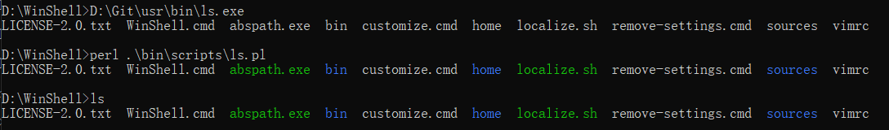

# Simple Windows Shell

### How to colorize the output of `ls.exe` in Windows Command Prompt?

[Git for Windows](https://git-scm.com/downloads) consists of `ls.exe` binary utility, it is very convenient to colorize the output by simply creating an alias:

```shell
alias ls='ls --color=auto'
```

However, it is only applicable under `Git Bash`, not in `Windows Command Prompt`. I have zero interest in [PowerShell](https://learn.microsoft.com/en-us/powershell/scripting), so I need to find a way to colorize the output of `ls.exe` in `Windows Command Prompt`.

### How to run [lua](https://lua.org) scripts in Windows Command Prompt?

I think there are various ways to related scripts with `.lua` suffixes with the `lua.exe` interpreter via configuring the settings in `Windows Explorer`. I have zero interest in `Windows Explorer`, so I need find a way to invoke [Lua](https://lua.org) in `Windows Command Prompt`.

### Script Runner

I have written a simple **Script Runner** to solve above two problems. Its entire source is available in `sources/runner.c`.



Note the content of `bin\scripts\ls.pl`:

```perl
#!/usr/bin/perl

use strict;
use warnings;

my @args = @ARGV;
unshift(@args, '--color=auto');
unshift(@args, '/usr/bin/ls.exe');
exit(system(@args));
```

So, `Git for Windows` is required for runner of `ls.exe` to work. (Also, Lua5.3 is needed for runnber of `bitdump` to work.) Finally, double click `WinShell.cmd` to start `Windows Command Prompt`.
